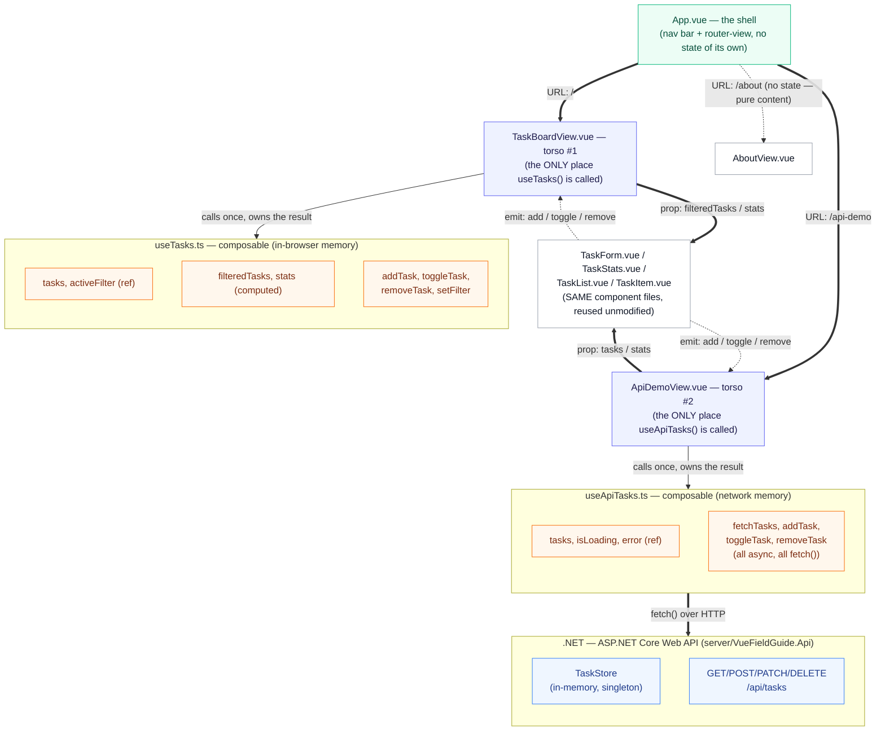

# 03 — Anatomy of the Task Board App

The way an anatomy chart labels a body — this organ, this is its name, this
is the one function it performs, this is what it connects to — this document
does the same thing for this repository's demo application. Every box below
is one real file in [`src/`](../src/); every arrow is one real prop, one
real custom event, or one real HTTP request — not a simplification.

The app has three pages (`/`, `/about`, `/api-demo`), reached through
[`src/router/index.ts`](../src/router/index.ts). The diagram below covers
the two that hold data — the Task Board and the API Demo — since those are
where the interesting anatomy is.

## The diagram

**Reading key:** thick arrows are **props** (data flowing down); dashed
arrows are **custom events** (signals flowing back up); the double-line
arrow into the `.NET` box is a **network request** — a qualitatively
different kind of connection from the other two, since it can be slow or
fail (see [docs/05_API_INTEGRATION.md](05_API_INTEGRATION.md)).

## Why two torsos, one set of organs

The single biggest structural fact in this codebase: **`TaskForm.vue`,
`TaskStats.vue`, `TaskList.vue`, and `TaskItem.vue` are the exact same
files, byte for byte, whether they're rendering the Task Board or the API
Demo.** Neither page's component tree contains a single `if (usingApi)`
branch anywhere. That's only possible because those four components never
call `useTasks()` or `useApiTasks()` themselves — they only ever receive
data through props and report actions through emitted events (see
[docs/02_GUIDE.md, Level 5](02_GUIDE.md#level-5--props-and-custom-events-component-communication)).
Whichever parent view happens to be listening decides where an `add`/
`toggle`/`remove` event actually goes; the component firing it neither
knows nor cares.

## Organ by organ

### `App.vue` — the shell

[`src/App.vue`](../src/App.vue)

Used to be the torso before Vue Router was added; now it holds no task data
at all. It renders a navigation bar of three `<router-link>`s and a single
`<router-view>`, which is where the router substitutes in whichever view
matches the current URL. It is the only file every page shares.

### `TaskBoardView.vue` — torso #1 (local state)

[`src/views/TaskBoardView.vue`](../src/views/TaskBoardView.vue)

Calls `useTasks()` exactly once
([line 15](../src/views/TaskBoardView.vue#L15)) — the composable described
in [docs/02_GUIDE.md, Level 6](02_GUIDE.md#level-6--composables-sharing-logic-and-state-between-components).
Every task lives only in this browser tab's memory; refreshing the page
resets it back to the three seed tasks.

### `ApiDemoView.vue` — torso #2 (remote state)

[`src/views/ApiDemoView.vue`](../src/views/ApiDemoView.vue)

Calls `useApiTasks()` instead — same shape of composable, same four
operations, but every one of them is now an `async` function making a real
HTTP request to the ASP.NET Core Web API in
[`server/VueFieldGuide.Api/`](../server/VueFieldGuide.Api/). Tasks created
here persist as long as that API process keeps running, and are visible to
any other client that also calls it — a genuine (if simple) shared backend,
unlike the Task Board's per-tab local state. See
[docs/05_API_INTEGRATION.md](05_API_INTEGRATION.md) for the full request
trace.

### `AboutView.vue` — no state at all

[`src/views/AboutView.vue`](../src/views/AboutView.vue)

The in-app Tutorial page. Alongside `TaskStats.vue`, this is the app's other
example of a component with zero `ref`/`computed`/`defineProps` — it is pure
static content, included in the diagram only to show that not every page
needs to touch state to be a legitimate part of the app.

### The shared organs

[`src/components/`](../src/components/) — unchanged from before Vue Router
and the API Demo existed. See each file's own comments, or
[docs/04_CODE_WALKTHROUGH.md](04_CODE_WALKTHROUGH.md) for a click-by-click
trace through the Task Board's copy of them. The API Demo drives the exact
same files through `useApiTasks()`'s functions instead of `useTasks()`'s —
re-read those traces mentally substituting "an awaited `fetch()` call" for
"a synchronous array operation" and they hold for the API Demo page too,
right up until the point where the composable's own async logic takes over
(covered separately in docs/05).

## Why this shape, not a bigger one

A natural question: why does each view own its state instead of, say,
`App.vue` calling both composables once and passing everything down through
three levels of props? Because the Task Board and the API Demo are never
both on screen at once — the router only ever mounts one view at a time —
so there is no shared ancestor that actually *needs* both states
simultaneously. Lifting state up to `App.vue` "just in case" would only add
an extra layer of prop-forwarding with no real benefit. This is the same
"lift state up to the closest common parent that needs it" principle
introduced in the previous version of this document, just applied in the
other direction: keep state as low as it can go until something forces it
higher.

Continue to [docs/04_CODE_WALKTHROUGH.md](04_CODE_WALKTHROUGH.md) for the
Task Board's click-by-click traces, or
[docs/05_API_INTEGRATION.md](05_API_INTEGRATION.md) for how the API Demo's
requests actually travel to and from the ASP.NET Core Web API.
