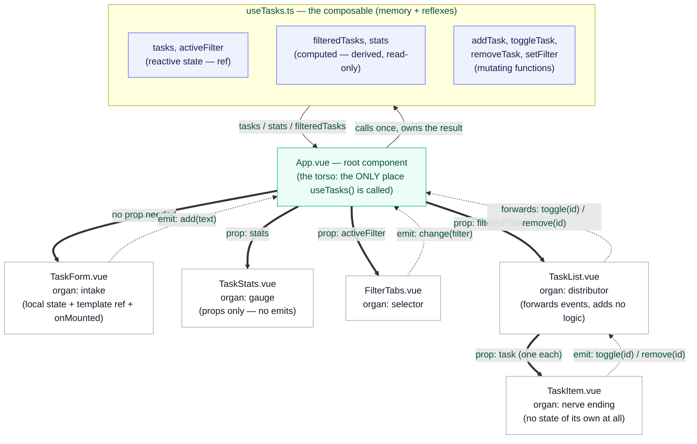

# 03 — Anatomy of the Task Board App

The way an anatomy chart labels a body — this organ, this is its name, this
is the one function it performs, this is what it connects to — this document
does the same thing for this repository's demo application. Every box below
is one real file in [`src/`](../src/); every arrow is one real prop or one
real custom event, not a simplification.

## The diagram

**Reading key:** solid/thick arrows are **props** (data flowing down);
dashed arrows are **custom events** (signals flowing back up). This mirrors
the "props down, events up" rule from
[docs/02_GUIDE.md, Level 5](02_GUIDE.md#level-5--props-and-custom-events-component-communication).

## Organ by organ

### `useTasks.ts` — the brain

[`src/composables/useTasks.ts`](../src/composables/useTasks.ts)

Not a component at all — a composable (see
[docs/02_GUIDE.md, Level 6](02_GUIDE.md#level-6--composables-sharing-logic-and-state-between-components)).
It is the only file in the app that holds the actual task data and the only
place allowed to change it. Every component in this app is, structurally, a
*view* onto data this file owns — none of them store a task list themselves.

### `App.vue` — the torso

[`src/App.vue`](../src/App.vue)

The root component: the one Vue.js mounts into the page (see
[`src/main.ts`](../src/main.ts)). It calls `useTasks()` exactly once
([line 18](../src/App.vue#L18)), which is what makes the resulting state
*shared* — every child below receives the same underlying reactive objects,
handed down as props. `App.vue` also is the only component that listens to
every custom event in the app and reacts by calling a composable function
(`@add="addTask"`, `@toggle="toggleTask"`, and so on). No other component
talks to `useTasks.ts` directly.

### `TaskForm.vue` — intake

[`src/components/TaskForm.vue`](../src/components/TaskForm.vue)

Takes no props at all — it needs nothing from the shared state to do its
job. It owns its own small piece of *local*, non-shared state (the draft
text being typed) and emits one event, `add`, when the form is submitted.
Also the app's only example of a **template ref** combined with a
**lifecycle hook**, used together to autofocus its input once the real page
element exists (see [docs/02_GUIDE.md, Level 7](02_GUIDE.md#level-7--lifecycle-hooks-and-template-refs)).

### `TaskStats.vue` — the gauge (a read-only organ)

[`src/components/TaskStats.vue`](../src/components/TaskStats.vue)

The simplest component in the app on purpose: it has a `defineProps` block
and **no `defineEmits` block at all**. Data only ever flows into it. Like a
speedometer needle, it displays a number derived from what's happening
elsewhere but has no mechanism to change anything itself.

### `FilterTabs.vue` — the selector

[`src/components/FilterTabs.vue`](../src/components/FilterTabs.vue)

Receives the *current* filter as a prop (so it knows which tab to highlight)
and emits `change` when a different tab is clicked. It never touches the
task list itself — it only ever reports "the user wants to see X now" and
lets `App.vue` decide what to do with that.

### `TaskList.vue` — the distributor

[`src/components/TaskList.vue`](../src/components/TaskList.vue)

Receives the (already-filtered) task array and renders one `TaskItem` per
task using `v-for`. Notice it adds no new logic of its own for toggling or
removing — it just re-emits whatever `TaskItem` tells it upward, unchanged,
to `App.vue`. This pattern (catch an event, immediately emit the same
information further up) is called **event forwarding**, and it's why
`TaskItem` never needs to know `App.vue` exists at all — it only needs to
know its immediate parent is listening for `toggle` and `remove`.

### `TaskItem.vue` — the nerve ending

[`src/components/TaskItem.vue`](../src/components/TaskItem.vue)

The component closest to the actual mouse click. It holds no state
whatsoever — not even a local `ref` — everything it shows comes from its
`task` prop, and every action available (checking it off, deleting it) is
reported upward as an event rather than handled locally. This is the
clearest single example in the codebase of "props down, events up" taken to
its logical conclusion: a component that is pure input (props) and pure
output (events), with no state of its own sitting in between.

## Why this shape, not a bigger one

A natural next question: why does `App.vue` hold the state instead of, say,
`TaskList.vue` owning the tasks directly? Because `TaskStats.vue` and
`FilterTabs.vue` also need access to that same data (the total count, the
active filter) and they are *siblings* of `TaskList.vue`, not its children —
sibling components in Vue.js cannot see each other's state directly. The
state has to live in the nearest shared ancestor, which is `App.vue`. This
principle — "lift state up to the closest common parent that needs it" — is
one of the first design decisions in almost every real Vue.js application,
and this demo was deliberately shaped so you'd run into needing it.

Continue to [docs/04_CODE_WALKTHROUGH.md](04_CODE_WALKTHROUGH.md) to trace
five real user actions through every one of these organs, function call by
function call.
